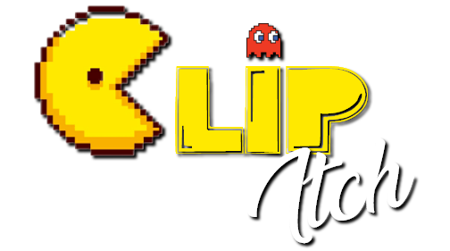

<h1>Clipitch</h1>
<h2>Conteúdo de Interesse</h2>

Projeto: Aplicações Web - 1º semestre

Sistemas de Informação

Pontifícia Universidade Católica de Minas Gerais

 

    
   

   Indexador de clips providos pela API do Twitch
   
  <a href="docs/01-Documentação de Contexto.md" rel="docs"><strong>Explore a documentação do Clipitch »</strong></a>
   
   
  <a href="docs/05-Arquitetura da Solução.md">Arquitetura</a>
  ·
  <a href="docs/06-Template padrão do Site.md">Interface</a>
  ·
  <a href="docs/08-Plano de Testes de Software.md">Testes de software</a>
  ·
  <a href="docs/10-Plano de Testes de Usabilidade.md">Testes de usabilidade</a>

## Enredo:

Segundo matéria disponibilizada no site de notícias PwC Brasil, o setor de entretenimento virtual vem demonstrando uma perspectiva de aumento que agregará uma receita de aproximadamente 43,7 bilhões de dólares somente no Brasil no decorrer do ano de 2021[[1]]. Considerando ainda o atual cenário pandêmico, as plataformas de transmissão de dados pela internet, principalmente aúdio e vídeo, sem a necessidade de baixar o conteúdo, serviços esses conhecidos como "streaming", adquiriram maior protagonismo e relevância. No caso das transmissões de jogos, a alta demanda pelos serviços pode ser comprovada pela pesquisa feita no site live.tt[[2]], que consatatou que a plataforma Twitch obteve um crescimento de 120% ao decorrer de 12 meses.

Não obstante o atual cenário caracterizado pela alta demanda de serviços de streaming e considerando a enorme quantidade de conteúdo que se propaga nas principais aplicações, como o YouTube e o Twitch, esse focado em jogos, os serviços são esparsos e desorganizados, fenômeno que faz com que muitos conteúdos de tais plataformas digitais permaneçam ocultos do conhecimento público. Mesmo com um crescimento tão significante, plataformas como o Twitch possuem um déficit de escalabilidade quando se trata de gerenciar o conteúdo que produzem e distribuí-los conforme o gosto dos usuários.

Portanto, a proposta tem por objetivo sanar a assimetria de informações existente entre o lado da oferta e da demanda, referente à plataforma Twitch, o que resultará em maior eficiência na forma como as transmissões de jogos são consumidas pelos usuários finais.

[1]: https://live.tt/pt/feeed/a-pandemia-os-games-e-o-crescimento-da-twitch/
[2]: https://www.pwc.com.br/pt/sala-de-imprensa/noticias/pwc-mercado-global-midia-entretenimento-movimentar-17.html/

  
 

 
## Integrantes

## Professor

 
 
# Documentação

<ol>
<li><a href="docs/01-Documentação de Contexto.md"> Documentação de Contexto</a></li>
<li><a href="docs/02-Especificação do Projeto.md"> Especificação do Projeto</a></li>
<li><a href="docs/03-Metodologia.md"> Metodologia</a></li>
<li><a href="docs/04-Projeto de Interface.md"> Projeto de Interface</a></li>
<li><a href="docs/05-Arquitetura da Solução.md"> Arquitetura da Solução</a></li>
<li><a href="docs/06-Template padrão do Site.md"> Template padrão do Site</a></li>
<li><a href="docs/07-Programação de Funcionalidades.md"> Programação de Funcionalidades</a></li>
<li><a href="docs/08-Plano de Testes de Software.md"> Plano de Testes de Software</a></li>
<li><a href="docs/09-Registro de Testes de Software.md"> Registro de Testes de Software</a></li>
<li><a href="docs/10-Plano de Testes de Usabilidade.md"> Plano de Testes de Usabilidade</a></li>
<li><a href="docs/11-Registro de Testes de Usabilidade.md"> Registro de Testes de Usabilidade</a></li>
<li><a href="docs/12-Apresentação do Projeto.md"> Apresentação do Projeto</a></li>
<li><a href="docs/13-Referências.md"> Referências</a></li>
</ol>

# Código

<li><a href="src/README.md"> Código Fonte</a></li>

# Apresentação

<li><a href="presentation/README.md"> Apresentação da solução</a></li>
