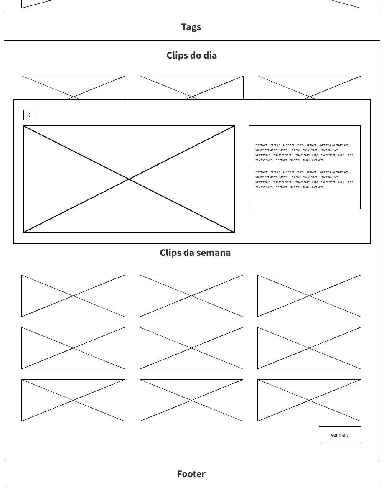

# Projeto de Interface

O projeto apresenta cinco interfaces principais: Home, Clips do dia, Clips da semana, Resultados da Pesquisa e Página de erro.

Na página home, estão dispostos e separados em categorias bem definidas: os três clips mais acessados do dia (no carrossel), os clips que foram adicionados à aplicação no dia e os clips que foram adicionados à aplicação na semana. Existe, também, um sistema de tags abaixo do carrossel. Essas tags são atalhos para a funcionalidade de busca, levando o usuário diretamente para a página de Resultados da pesquisa ao serem clicadas. Ao clicar em um clip, um modal abre e o conteúdo é reproduzido em seu interior.

O conteúdo é organizado dessa maneira para facilitar que o usuário tenha acesso a uma grande gama de conteúdos de forma simples, sem que tenha que gastar muito tempo acessando outras seções do website.

Caso o usuário deseje acessar uma maior quantidade de clips, sejam os mais acessados do dia ou da semana, é possível fazê-lo ao clicar no botão "Ver mais", próximo à última fileira de Clips do dia e Clips da semana.

Em todas as páginas há botões que redirecionam o usuário para a Home, além de outras seções da aplicação web, e a funcionalidade de Pesquisa.
## User Flow

## Wireframes

### Home

### Clips do dia/semana/resultado da pesquisa

### Modal

### Mobile

<a href="./03-Metodologia.md">Metodologia</a> | <a href="./05-Arquitetura da Solução.md">Arquitetura da Solução</a>
