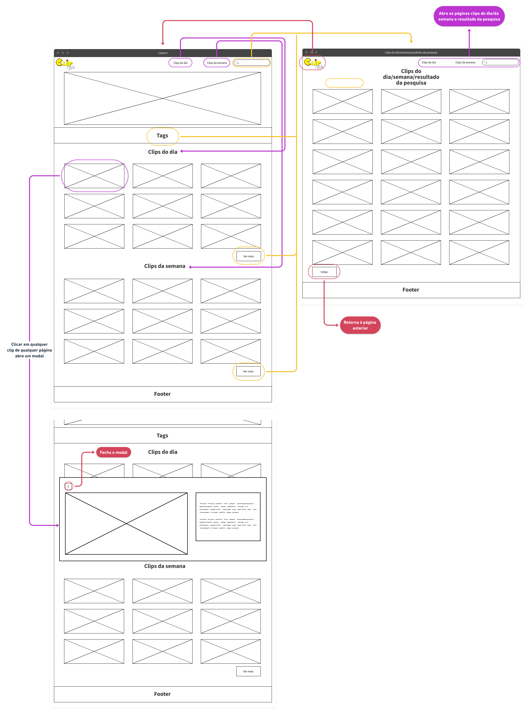
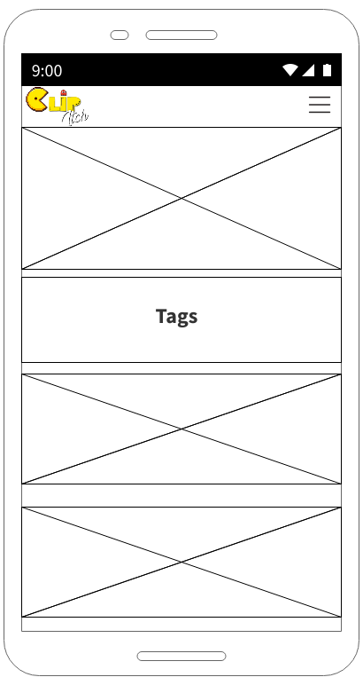

# Projeto de Interface

O projeto apresenta quatro interfaces principais: Home, Resultados da busca, Clips do dia e Clips da semana.

Na página home, estão dispostos o clip mais acessado do dia, os clips que foram adicionados à aplicação no dia e na semana, ordenados por maior número de visualizações e separados em categorias bem definidas. O conteúdo é organizado dessa maneira para facilitar que o usuário tenha acesso a uma grande gama de conteúdos de forma simples, sem que tenha que gastar muito tempo acessando outras seções do website.

 Caso o usuário deseje acessar uma maior quantidade de clips, sejam os mais acessados do dia ou da semana, é possível fazê-lo acessando as páginas Clips do dia e Clips da semana.

 Em todas as páginas há botões que redirecionam para a home, pesquisa por clips e outras sessões da aplicação web - clips mais acessados do dia e clips mais acessados da semana.

## User Flow

## Wireframes

