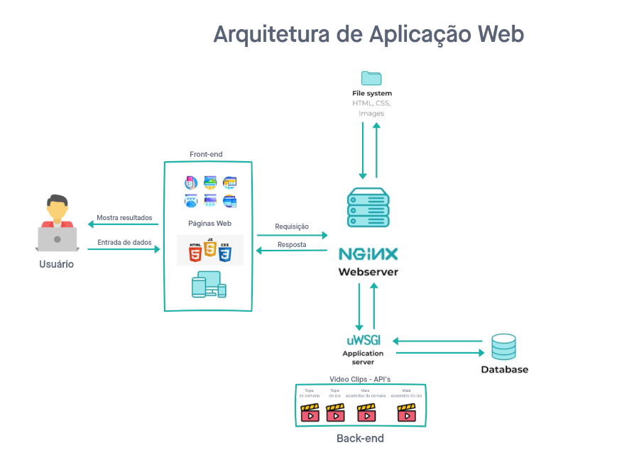

<div align="justify">

# Arquitetura da Solução

A aplicação web é estruturada através do front-end, banco de dados nativo ao browser e API do Twitch.

O front-end é responsável por desenvolver por meio de código uma interface gráfica com as tecnologias base da Web:

- **HTML** - utilizado para criar toda a estrutura da página.

- **CSS** - responsável por separar a parte estrutural da aplicação da parte estética, promovendo assim a estilização do conteúdo.

- **JavaScript** - que irá fornecer à página web a possibilidade de programação, transformação e processamento de dados enviados e recebidos, interagindo com a marcação e exibição de conteúdo da linguagem HTML e com a estilização desse conteúdo proporcionada pelo CSS.

O banco de dados que utilizará-se é o IndexedDB. Esse banco de dados baseado em JavaScript orientado a objetos é compatível com os principais navegadores da atualidade.

A API do Twitch a ser utilizada é a [Legacy Twitch API v5](https://dev.twitch.tv/docs/v5) que, embora depreciada, é a única que oferece os endpoints necessários para a execução do projeto. Caso a versão atual da API, [Helix](https://dev.twitch.tv/docs/api/), eventualmente ofereça os endpoints adequados para o propósito do projeto, é possível que altere-se o código para utilizá-la.

A hospedagem da aplicação web será feita no Heroku.
## Diagrama de componentes



A solução implementada conta com os seguintes módulos:

- **Páginas web** - Conjunto de arquivos HTML, CSS, JavaScript e imagens que implementam as funcionalidades do sistema;

- **Banco de dados (IndexedDB)** - É uma coleção organizada de dados, de modo que pode ser facilmente acessada e gerenciada;

- **Twitch API** - Conjunto de pontos de acesso aos clips do Twitch através do front-end;

- **Hospedagem** - Local na Internet onde as páginas são mantidas e acessadas pelo navegador;

## Tecnologias Utilizadas

- Liguagens de programação: [HTML](https://devdocs.io/html/), [CSS](https://developer.mozilla.org/pt-BR/docs/Web/CSS), [JavaScript](https://developer.mozilla.org/pt-BR/docs/Web/JavaScript);
- [Bootstrap](https://getbootstrap.com/) (Framework CSS);

- [IndexedDB](https://developer.mozilla.org/en-US/docs/Web/API/IndexedDB_API) (Banco de dados nativo ao browser);

- [Twitch API](https://dev.twitch.tv/docs/api/) (Fonte dos clips que serão o conteúdo do projeto);

- [Heroku](https://www.heroku.com/) (Hospedagem de aplicação que visa o desenvolvimento web em nuvem).

## Hospedagem

A hospedagem da aplicação será na plataforma Heroku, uma plataforma como serviço (PaaS).

O Heroku não é capaz de nativamente referenciar a página principal da aplicação web. Dessa forma, é necessário criar um arquivo `index.php` na pasta raíz do projeto a fim de referenciar o `index.html`:

```php
<?php include_once("index.html");?>
```

Após a adição desse arquivo, basta fazer o upload da pasta raíz do projeto e fazer o deploy do site.</div>

<hr>

<p align="right"><a href="docs/04-Projeto de Interface" rel="docs">Projeto de Interface</a> | <a href="docs/06-Template padrão do Site" rel="docs">Template padrão do Site</a></p>


