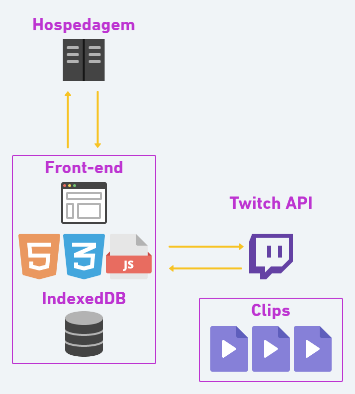

# Arquitetura da Solução

A aplicação web é estruturada através do front-end, back-end, API do Twitch e banco de dados.

O front-end é responsável por desenvolver por meio de código uma interface gráfica, com as tecnologias base da Web:

- **HTML** (utilizado para criar toda a estrutura da página).
- **CSS** (responsável por separar a parte estrutural da aplicação da parte estética, promovendo assim a estilização do conteúdo).
- **JavaScript** (que irá fornecer à página web a possibilidade de programação, transformação e processamento de dados enviados e recebidos, interagindo com a marcação e exibição de conteúdo da linguagem HTML e com a estilização desse conteúdo proporcionada pelo CSS).

O front-end faz uma requisição ao back-end, solicitando a consulta de dados através de APIs disponibilizadas pelo back-end. Após o tratamento dos dados solicitadas, o front-end recebe as informações advindas do back-end e executa a renderização das informações (formatação e tratativa dos dados). Por fim, o front-end apresenta as informações na tela do usuário devidamente formatadas e tratadas.

Os dados que são processados pelo back-end - de acordo com as requisições do front-end - são providos pela API do Twitch e as informações resultantes são utilizadas para renderizar o conteúdo que será disposto na aplicação web. O back-end será desenvolvido em Python, utilizando-se o framework Django.

A API do Twitch a ser utilizada é a [Legacy Twitch API v5](https://dev.twitch.tv/docs/v5) que, embora depreciada, é a única que oferece os endpoints necessários para a execução do projeto. Caso a versão atual da API, [Helix](https://dev.twitch.tv/docs/api/), eventualmente ofereça os endpoints adequados para o propósito do projeto, é possível que altere-se o código para utilizá-la.

A solução utilizará um banco de dados relacional SQL e a hospedagem da aplicação web será feita no Heroku.

## Diagrama de componentes



<center>Figura 01 - Arquitetura da Solução</center>

A solução implementada conta com os seguintes módulos:

- **Navegador** - Interface básica do sistema
- **Páginas Web** - Conjunto de arquivos HTML, CSS, JavaScript e imagens que implementam as funcionalidades do sistema.
- **Servidor Web** - responsável por aceitar pedidos em HTTP de clientes e servi-los com respostas em HTTP.
- **Servidor de aplicação web** - fornece ambiente para a instalação e execução de aplicações web.
- **Back-end** - É responsável por armazenar e organizar os dados e garantir que tudo no lado do cliente realmente funcione.
- **Hospedagem** - local na Internet onde as páginas são mantidas e acessadas pelo navegador.
- **Top Clips API** - Conjunto de pontos de acesso aos clips do Twitch através do Front-end.
- **Banco de dados** - É uma coleção organizada de dados, de modo que pode ser facilmente acessado e gerenciado.

## Tecnologias Utilizadas

- [Twitch API](https://dev.twitch.tv/docs/api/) (Fonte dos clipes que serão o conteúdo do projeto)
- [GitHub](https://github.com/) (Versionamento e hospedagem do projeto)
- [Heroku](https://www.heroku.com/) (Hospedagem de aplicação que visam o desenvolvimento web em nuvem)
- [Banco de Dados SQL - SQL Server](https://www.microsoft.com/pt-br/sql-server)
- Liguagens de programação: [Python](https://docs.python.org/3/), [HTML](https://devdocs.io/html/), [CSS](https://developer.mozilla.org/pt-BR/docs/Web/CSS), [Java Script](https://developer.mozilla.org/pt-BR/docs/Web/JavaScript)
- [Figma](https://www.figma.com/) (Desenvolvimento de interface)
- [Invision](https://www.invisionapp.com/) (Desenvolvimento da diagramação)
- [Microsoft Teams](https://www.microsoft.com/pt-br/microsoft-teams/group-chat-software) (Planejamento do time) com a metodologia Scrum aplicada
- [Visual Studio Code](https://code.visualstudio.com/)

### Exemplo


## Hospedagem

A hospedagem da aplicação vai ser na plataforma Heroku, que é uma plataforma como serviço (PaaS Platform as a service ). Primeiramente vamos abrir uma conta na plataforma. Usaremos o Git para fazermos o deploy da aplicação. Vamos precisar instalar uma ferramenta própria do Heroku chamada Toolbet é por meio dela que vamos criar nossa aplicação na plataforma utilizando linhas de comando ou fazendo o download das plataformas especializadas.

Vamos criar um diretório:

heroku_clipitch

```
user@machine:~/$ mkdir heroku_clipitch
user@machine:~/$ cd heroku_clipitch
user@machine:~/heroku_clipitch$
```

Como estaremos usando python para o backend vamos criar um virtualenv e ativa-lo:

```
user@machine:~/heroku_clipitch$ virtualenv venv
New python executable in venv/bin/python
Installing setuptools, pip...done.
user@machine:~/heroku_clipitch$ source venv/bin/activate
(venv)user@machine:~/heroku_clipitch$
```

Vamos criar o arquivo procfile que será onde o comando que o heroku irá usar para executar nossa aplicação será escrito. Esse arquivo deverá estar na raiz da aplicação.

```
(venv)user@machine:~/heroku_clipitch$ echo "web: python clipitch.py" > Procfile
```

Vamos agora efetivar o processo de deploy da aplicação:

Primeiro vamos criar um repositório no diretório atual:

git init

```
(venv)user@machine:~/heroku_clipitch$ git init
Initialized empty Git repository in /home/user/heroku_clipitch/.git/
```

Vamos adicionar e commitar nossos arquivos nesse repositório através dos comandos git add para adicionar todos os arquivos e git commit para criar nosso commit inicial.

```
(venv)user@machine:~/heroku_clipitch$ git add .
(venv)user@machine:~/heroku_clipitch$ git commit -m 'initial commit'
[master (root-commit) 33f63b5] initial commit
 4 files changed, 25 insertions(+)
 create mode 100644 .gitignore
 create mode 100644 Procfile
 create mode 100644 clipitch.py
 create mode 100644 requirements.txt
(venv)user@machine:~/heroku_clipitch$
```

Agora vamos criar nosso app no heroku através do commando heroku apps:create [nome do app]

```
(venv)user@machine:~/heroku_clipitch$ heroku apps:create dg-clipitch
Creating dg-clipitch... done, stack is cedar-14
https://dg-clipitch.herokuapp.com/ | https://git.heroku.com/dg-clipitch.git
Git remote heroku added
```

No resultado do comando heroku apps:create já são apresentadas duas das coisas mais importantes para nosso app, a url de acesso e repositório git onde deverá ser enviada nossa aplicação.

Basicamente a url será no padrão https://[nome do app].herokuapp.com/.

Finalmente iremos realizar o deploy de nossa aplicação. Todos os passos anteriores foram passos preparatórios, o que significa que basta executá-los uma vez.

Daqui em diante, para fazer o deploy de nosso app, basta enviar os commits do repositório local, para o repositório do heroku, através do comando git push heroku master.

```
(venv)user@machine:~/heroku_clipitch$ git push heroku master
```

Agora é só acessar a url do app.
