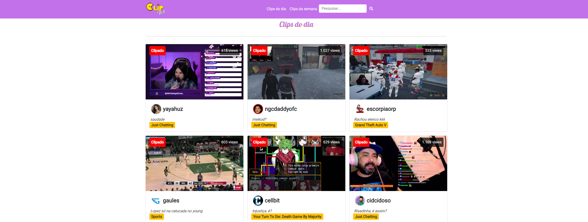

# Template padrão do site
## Layout de referência:

<a href="docs/05-Arquitetura da Solução.md" rel="docs">Arquitetura da Solução</a> | <a href="docs/07-Programação de Funcionalidades.md" rel="docs">Programação de Funcionalidades</a>

