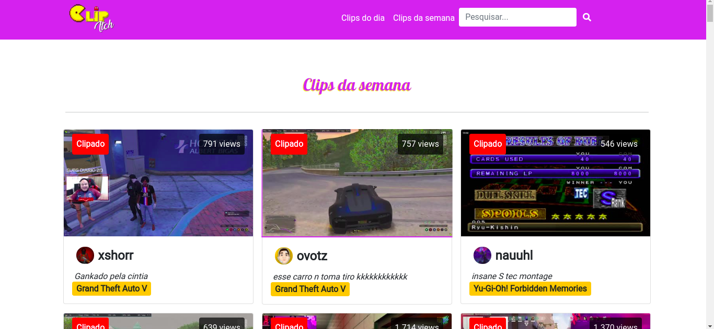

<div align="justify">

# Programação de Funcionalidades

## Estruturas de dados

Foram desenvolvidos três arquivos no formato `.js`: `banco.js` contém os métodos para a manipulação do banco de dados, disposição dos clips nas páginas e pesquisa; `script.js` é responsável por autenticar o acesso da aplicação web à API do Twitch, criação do banco de dados, filtros de pesquisa e interatividade das páginas HTML; `search.js` trata a chamada ao método de filtragem de pesquisa.

Em todos esses arquivos utilizou-se as estruturas de dados básicas da programação: **estruturas sequenciais**, **condicionais** e de **repetição**. O uso de **vetores** também foi bastante presente. Como essas estruturas de dados foram usadas em basicamente todos os arquivos JavaScript do projeto, decidiu-se abordar esse assunto neste tópico ao invés de citá-lo de forma redundante no tópico relacionado às funcionalidades do sistema.

Outra estrutura de dados importantíssima que foi processada pela aplicação web é um arquivo no formato **JSON** provido pela API do Twich com diversas informações sobre um clip. A seguir, um exemplo dessa estrutura de dados:</div>

```json
{
  "slug": "AmazonianEncouragingLyrebirdAllenHuhu",
  "tracking_id": "13160765",
  "url": "https://clips.twitch.tv/AmazonianEncouragingLyrebirdAllenHuhu?tt_medium=clips_api&tt_content=url",
  "embed_url": "https://clips.twitch.tv/embed?clip=AmazonianEncouragingLyrebirdAllenHuhu&tt_medium=clips_api&tt_content=embed",
  "embed_html": "<iframe src='https://clips.twitch.tv/embed?clip=AmazonianEncouragingLyrebirdAllenHuhu&tt_medium=clips_api&tt_content=embed' width='640' height='360' frameborder='0' scrolling='no' allowfullscreen='true'></iframe>",
  "broadcaster": {
    "id": "12826",
    "name": "twitch",
    "display_name": "Twitch",
    "channel_url": "https://www.twitch.tv/twitch",
    "logo": "https://static-cdn.jtvnw.net/jtv_user_pictures/twitch-profile_image-8a8c5be2e3b64a9a-300x300.png"
  },
  "curator": {
    "id": "59222117",
    "name": "skiptoplay",
    "display_name": "SkipToPlay",
    "channel_url": "https://www.twitch.tv/skiptoplay",
    "logo": "https://static-cdn.jtvnw.net/jtv_user_pictures/skiptoplay-profile_image-1d66e001a46b0c9d-300x300.png"
  },
  "vod": {
    "id": "107049351",
    "url": "https://www.twitch.tv/videos/107049351?t=0s"
  },
  "game": "",
  "language": "en",
  "title": "Clip Title Editing",
  "views": 106,
  "duration": 32.000333,
  "created_at": "2016-12-14T16:28:49Z",
  "thumbnails": {
    "medium": "https://clips-media-assets.twitch.tv/vod-107049351-offset-26-preview-480x272.jpg",
    "small": "https://clips-media-assets.twitch.tv/vod-107049351-offset-26-preview-260x147.jpg",
    "tiny": "https://clips-media-assets.twitch.tv/vod-107049351-offset-26-preview-86x45.jpg"
  }
}
```
<div align="justify">

## Funcionalidades do sistema

Abaixo encontram-se todas as funcionalidades implementadas de acordo com os requisitos funcionais listados no planejamento do projeto. As tabelas completas de requisitos funcionais e não funcionais podem ser encontradas na [especificação do projeto](https://github.com/ICEI-PUC-Minas-PMV-SI/pmv-si-2021-1-e1-proj-web-t1-conteudo-de-interesse/edit/main/docs/02-Especifica%C3%A7%C3%A3o%20do%20Projeto.md).

Os métodos desenvolvidos estão devidamente documentados no código fonte do projeto.
### O site vai estar disponível para todos os browsers sem necessidade de login (RF-001)

A aplicação web não requere cadastro para ser utilizada.
### No site vai existir um campo visível na parte de cima da tela com a palavra: “Pesquisar” (RF-002)

A aplicação web apresenta cinco páginas distintas: home, clips do dia, clips da semana, resultado da pesquisa e erro. Em todas essas páginas um campo de busca foi implementado na barra de navegação que encontra-se na parte superior do site.

Os códigos responsáveis por essa funcionalidade encontram-se nos arquivos `banco.js`, `script.js` e `search.js`.

Para utilizar essa funcionalidade, basta acessar qualquer página da aplicação web, digitar o termo a ser buscado no campo *Pesquisar* e clicar na lupa ao lado.


**Acesso:** https://clipitch.herokuapp.com
### O site vai ser capaz de rodar os vídeos de forma embutida (RF-003)

Todos os clips contidos na aplicação web apresentam a capacidade de serem assistidos de forma embutida. Utilizou-se os links para embeds - a propriedade `"embed_url"` do arquivo JSON provido pela API do Twitch - para desenvolver essa funcionalidade.

O código responsável por essa funcionalidade encontra-se no arquivo `banco.js`.

Assim como a funcionalidade de pesquisa, essa funcionalidade está disponível em todas as páginas da aplicação web.


**Acesso:** https://clipitch.herokuapp.com
### O site deverá incorporar as funcionalidades de tela do Twitch como pause e tamanho de tela (RF-004)

Os embeds em todas as páginas da aplicação web contém as funcionalidades nativas do player do Twitch: play/pause, mute, share, fullscreen e settings (qualidade de imagem do vídeo, velocidade de reprodução, configurações avançadas e atalhos de teclado).

É possível visualizar alguns dos ícones das opções mencionadas acima na imagem do tópico anterior.

**Acesso:** https://clipitch.herokuapp.com
### O site vai disponibilizar em sua home os clipes mais acessados no momento e aqueles de maior sucesso (RF-005)

O site apresenta, em destaque em sua página inicial, abaixo da barra de navegação, um carrossel contendo os três clipes mais acessados no momento. O carrossel conta com botões direcionais (setas) para navegar entre esses clips.

O método responsável por popular essa funcionalidade encontra-se no arquivo `banco.js`.

Para utilizar essa funcionalidade, basta acessar a página inicial da aplicação web.


**Acesso:** https://clipitch.herokuapp.com
### O site deve ser capaz de disponibilizar uma parte com os melhores clipes do dia (RF-006)

O site apresenta, em destaque em sua página inicial, abaixo do carrossel, uma seção que contém os nove clips mais acessados do dia. Abaixo dos clips há um botão que leva o usuário para uma página que apresenta apenas os clips mais acessados do dia (nessa página também existe um botão que leva o usuário de volta à pagina anterior).

Os métodos responsáveis por popular essa funcionalidade encontram-se no arquivo `banco.js`.

Para utilizar essa funcionalidade, basta acessar a página inicial da aplicação web. Para acessar mais clips é necessário clicar no botão "Ver mais", próximo à última fileira de clips do dia.


**Acesso:** https://clipitch.herokuapp.com, https://clipitch.herokuapp.com/clipsdia.html

### O site deve ser capaz de disponibilizar uma parte com os melhores clipes da semana (RF-007)

O site apresenta, em destaque em sua página inicial, abaixo do carrossel, uma seção que contém os nove clips mais acessados da semana. Abaixo dos clips há um botão que leva o usuário para uma página que apresenta apenas os clips mais acessados da semana (nessa página também existe um botão que leva o usuário de volta à pagina anterior).

Os métodos responsáveis por popular essa funcionalidade encontram-se no arquivo `banco.js`.

Para utilizar essa funcionalidade, basta acessar a página inicial da aplicação web. Para acessar mais clips é necessário clicar no botão "Ver mais", próximo à última fileira de clips da semana.



**Acesso:** https://clipitch.herokuapp.com, https://clipitch.herokuapp.com/clipssemana.html
### O site deve ser capaz de exibir os conteúdos da plataforma Twitch usando como filtro os títulos dos jogos (RF-008)

A partir dos dados obtidos da API desenvolveram-se métodos para inserir em um vetor a quantidade de vezes que um mesmo jogo repete-se na lista de clips. Foi possível, então, tratar esse vetor ao utilizar outros métodos e extrair informações relevantes para a criação de um sistema dinâmico de tags para os jogos mais populares.

Os métodos responsáveis por popular essa funcionalidade encontram-se no arquivo `banco.js`.

Para utilizar essa funcionalidade, basta acessar a página inicial e clicar em uma das tags para ser redirecionado a uma página de resultado de pesquisa que contém apenas clips relativos à tag clicada.


**Acesso:** https://clipitch.herokuapp.com
</div>

<hr>

<p align="right"><a href="docs/06-Template padrão do Site" rel="docs">Template padrão do Site</a> | <a href="docs/08-Plano de Testes de Software" rel="docs">Plano de Testes de Software</a></p>

