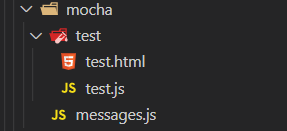
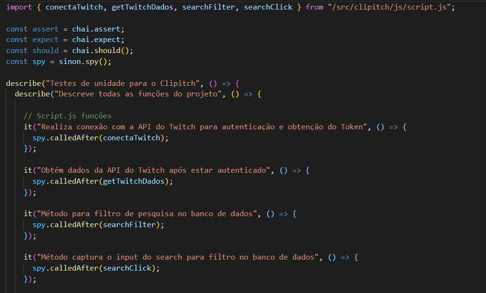

<div align="justify">

# Plano de Testes de Software

A fim de garantir a qualidade e obter certeza da implementação correta do desenvolvimento do software do projeto, utilizou-se frameworks e bibliotecas que permitem simular todo o processo de usabilidade. Os testes percorrem as chamadas aos métodos e retornam os valores esperados, de forma discreta e certeira.
## Ferramentas de Testes

- [Mocha JS](https://mochajs.org/)
- [Chai JS](https://www.chaijs.com/)
- [Sinon JS](https://sinonjs.org/)

De acordo com a documentação do Mocha JS, adicionaram-se esses arquivos no repositório para que os testes pudessem ser inicializados:



Dentro da pasta *test*, encontra-se uma estrutura de interface e uma de modelagem dinâmica que é feita pelo JavaScript. Essa estrutura tem o intuito de fazer a chamada de cada método desenvolvido no projeto e retornar em um relatório no formato HTML os resultados do teste.


Essas chamadas são feitas dentro do arquivo `test.js`, no qual é feito todo o processo de chamadas no banco e nos scripts criados para o funcionamento do projeto. Atráves das chamadas feitas com as bibliotecas Chai e Sinon, implementadas juntamente ao framework Mocha JS, desenvolveu-se o seguinte formato de teste:



### Explicação dos métodos

```mocha.js|chai.js|sinon.js - Describe
  describe("Descreve todos os métodos do projeto", () => { 'Métodos de testes a serem implementados' };
```

O método describe serve para iniciar uma lista detalhada do que será executado dentro da *arrow function* chamada pela mesma.

```mocha.js|chai.js|sinon.js - It
  it("Realiza a chamada do método retornado de algum outro arquivo JS ou do próprio arquivo", () => {
      spy.calledAfter( 'Método a ser testado' );      
    });
```

O método `it` inicializa o processo de teste e aguarda o método chamado pela arrow function ser retornado, podendo, assim, analisar se foi executada com sucesso ou se conteve algum erro. Todavia, como grande parte dos métodos desenvolvidos são chamadas void (sem retorno), foi necessária a utilização da biblioteca Sinon para fazer o processo de "espionagem" do método quando ele é chamado - que retorna o valor true caso seja feito com sucesso.</div>

<hr>

<p align="right"><a href="./07-Programação de Funcionalidades.md">Programação de Funcionalidades</a> | <a href="./09-Registro de Testes de Software.md">Registro de Testes de Software</a></p>