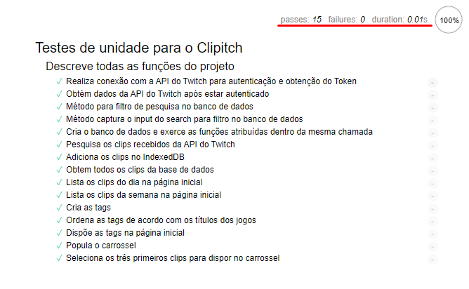

# Registro de Testes de Software

Pré-requisitos: <a href="04-Projeto de Interface.md"> Projeto de Interface</a>, <a href="08-Plano de Testes de Software.md"> Plano de Testes de Software</a>

Teste feito das funções disponibilizadas durante o desenvolvimento do ClipItch:

Os testes do ClipItch estão disponíveis em produção, basta acessar o seguinte link: 
[Testes de Software | ClipItch](https://clipitch.herokuapp.com/mocha/test/test.html) para ter acesso a eles, contendo, também, todas as funções que foram implementadas ao clicar em cada um, ou, caso prefira no documento: <a href="08-Plano de Testes de Software.md"> Plano de Testes de Software</a>, está disponibilizado a explicação detalhada da implementação dos testes de softwares realizados durante o desenvolvimento do projeto.

## Avaliação

Todos os testes foram realizados com sucesso, como pode ser observado na imagem acima, todavia, existem algumas limitações para se testar funções sem retorno de dados, dessa forma, optamos pela utilização do Sinon JS em conjunto com o Mocha JS, para podermos simular uma chamada sem retorno e conferir se ela foi de fato executada, se o mesmo ocorre, é retornado o valor true como resposta, sendo exibido no HTML como "teste realizado com sucesso".
